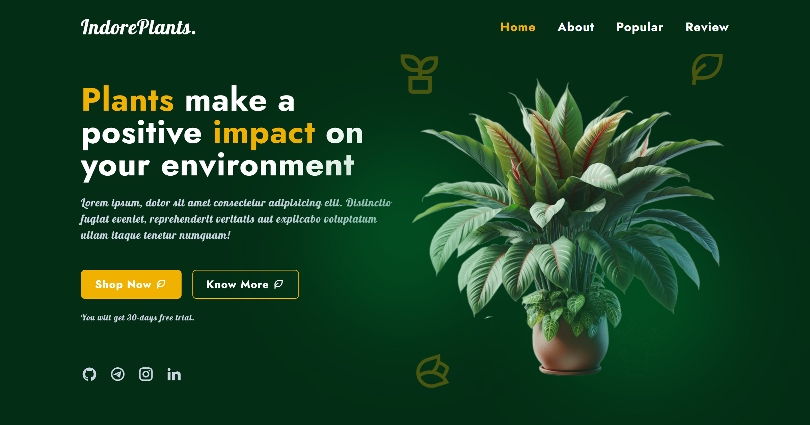

# 🌱 Plants Website

<h3 align="center">
  🌿 Modern Plant Website — Responsive, Animated & Production-Ready
</h3>

  Built with Vite • TailwindCSS • Vanilla JS

---

## 📄 Recruiter-Friendly Version

- Detailed overview: [📖 Full README](./README.md)
- Complete docs: [📚 /docs](./docs/)
- 📂 [Repository](https://github.com/KhusniddinIskandarov/plants-website)

---

## 📸 Previews

A modern frontend project built with a structured Git workflow and incremental architecture-driven development.

### Responsive Views 👇

🔗 [🖥️ Desktop](https://github.com/KhusniddinIskandarov/plants-website-showcase/blob/main/screenshots/desktop.webp)
🔗 [📲 Tablet](https://github.com/KhusniddinIskandarov/plants-website-showcase/blob/main/screenshots/tablet.webp)
🔗 [📱 Mobile](https://github.com/KhusniddinIskandarov/plants-website-showcase/blob/main/screenshots/mobile.webp)

👉 More previews: 📂 [Showcase Repository - (GIFs & Videos)](https://github.com/KhusniddinIskandarov/plants-website-showcase)

---

## 🚀 Live Demos

- [Vercel](https://khusniddin-plants-website.vercel.app)
- [Netlify](https://khusniddin-plants-website.netlify.app)
- [GitHub Pages](https://khusniddiniskandarov.github.io/plants-website)

---

## 📄 Showcase Documents

- 🔗 [Short Docs (README)](https://github.com/KhusniddinIskandarov/plants-website-showcase/blob/main/README.md)
- 🔗 [Ultra‑Short Docs (README)](https://github.com/KhusniddinIskandarov/plants-website-showcase/blob/main/README-short.md)

---

## 🧠 Why This Project Matters

This project is designed to reflect **real-world frontend development**, not tutorial-level code.

It demonstrates:

- Scalable architecture and separation of concerns
- Maintainable and reusable component structure
- Real-world Git workflow (feature branches)
- Performance-focused UI implementation

💡 Built to match expectations of modern frontend teams.

---

## 🔥 Key Highlights

- 🧩 scalable modular architecture
- 🎯 production-ready (no frameworks)

---

## 🎯 Project Goals

- build a fully responsive and interactive UI
- apply modular and scalable architecture
- create reusable UI components
- follow a professional Git workflow (feature branches)
- deliver a portfolio-ready production-level project

---

## ✨ Features

### 🌿 Sections

- Hero · Services · About
- Popular Plants · Reviews · Footer

### 🎬 UX

- scroll reveal · swiper carousel
- scroll-up button · active nav links

---

## Stack

- Vite · TailwindCSS · JavaScript
- ESLint · Prettier · Husky
- Swiper · ScrollReveal

---

## Current Status

**v1.1.0** — Performance & Accessibility release complete.

---

## 📈 Lighthouse Scores

<table>
<tr>
<td>

### 🖥️ Desktop

| Category       | Score  |
| -------------- | ------ |
| Performance    | 100 ✅ |
| Accessibility  | 96 ✅  |
| Best Practices | 100 ✅ |
| SEO            | 100 ✅ |

</td>
<td>

### 📱 Mobile

| Category       | Score  |
| -------------- | ------ |
| Performance    | 87 ✅  |
| Accessibility  | 100 ✅ |
| Best Practices | 100 ✅ |
| SEO            | 100 ✅ |

</td>
</tr>
</table>

---

## 👨‍💻 Author

**Khusniddin Iskandarov**

- 🐙 GitHub: [KhusniddinIskandarov](https://github.com/KhusniddinIskandarov)
- 💼 LinkedIn: [khusniddiniskandarov](https://www.linkedin.com/in/khusniddiniskandarov)
- 📸 Instagram: [@khusniddiniskandarov](https://www.instagram.com/khusniddiniskandarov)
- 💬 Telegram: [@khusniddiniskandarov](https://t.me/KhusniddinIskandarov)
- 📧 Email: [kh.sh.iskandarov@gmail.com](mailto:kh.sh.iskandarov@gmail.com)

---

## 📚 Documentation

Full documentation available in [`/docs`](./docs/) directory.

→ See [README.md](./README.md) for complete reference.
